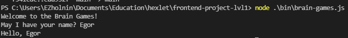
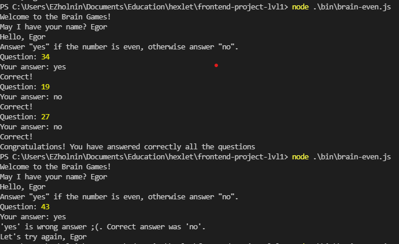
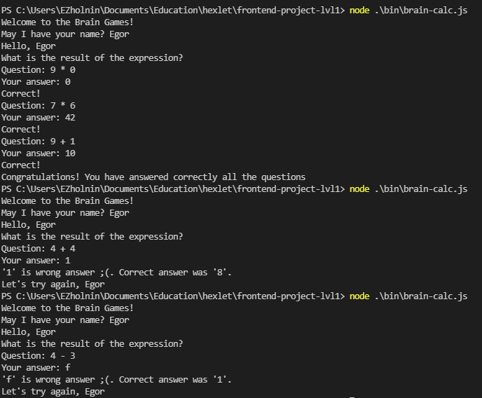
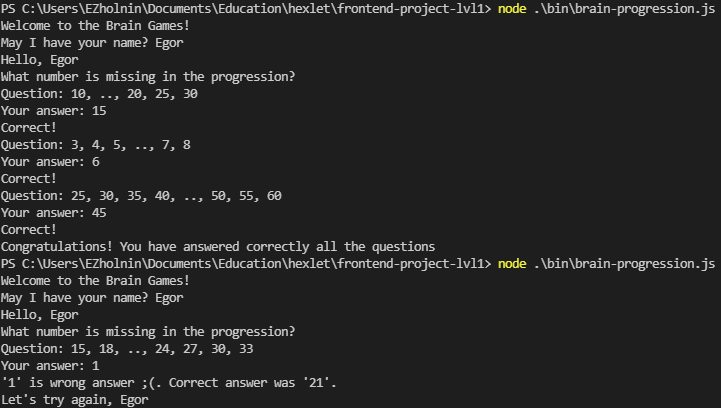
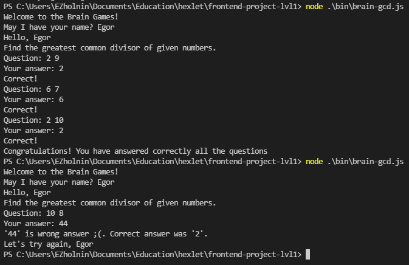
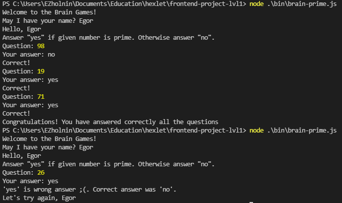

### Hexlet tests and linter status:

This is a list of games in terminal.

Prepearing:

`yarn`

### Games

### Greating

`node bin/brain-game.js`

### Brain Even

`node bin/brain-even.js`

### Brain Calc

`node bin/brain-calc.js`

### Brain Progression

`node bin/brain-progression.js`

### Brain GCD

`node bin/brain-gcd.js`

### Brain Prime

`node bin/brain-prime.js`

